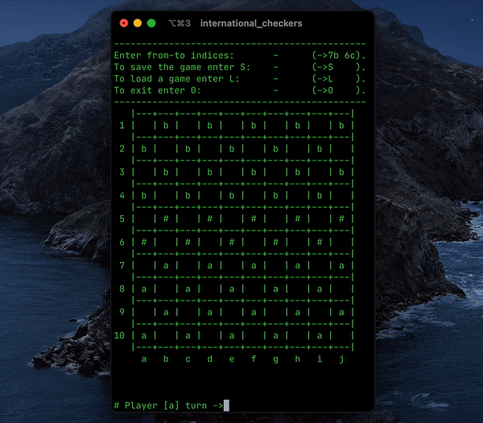

# International Checkers

  

C++ Implementation of [International Checkers](https://en.wikipedia.org/wiki/International_draughts)

## Usage:

- `make` to compile.

- `./international_checkers` to run.

- `make clean` to clean.
